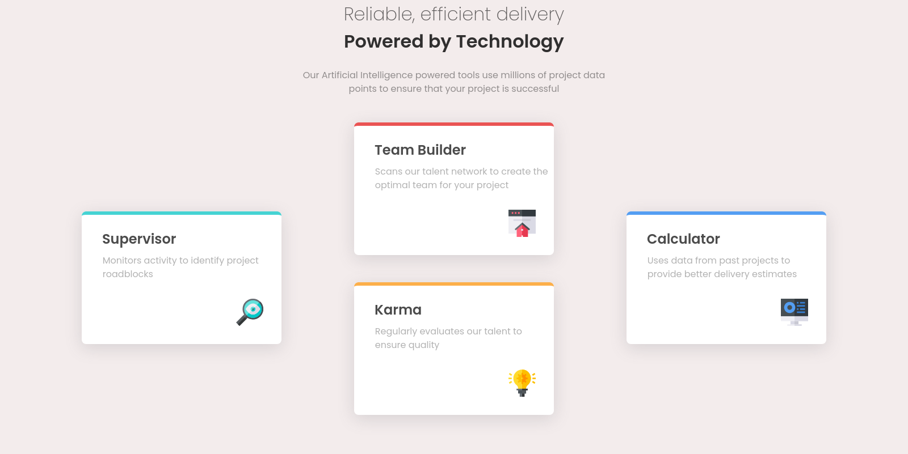

# Frontend Mentor - Four card feature section solution

This is a solution to the [Four card feature section challenge on Frontend Mentor](https://www.frontendmentor.io/challenges/four-card-feature-section-weK1eFYK).

## Table of contents

- [Overview](#overview)
  - [The challenge](#the-challenge)
  - [Screenshot](#screenshot)
  - [Links](#links)
- [Built with](#built-with)
- [Project structure](#project-structure)

## Overview

### Screenshot



### Links

- [Solution](https://github.com/nerdy-guy/four-card-feature-section-master)

- [Live Site](https://nerdy-guy.github.io/four-card-feature-section-master)

## Built with

- Semantic HTML5 markup
- CSS custom properties
- Flexbox
- CSS Grid

## Project structure

```
four-card-feature-section-master
├── images
│   ├── favicon-32x32.png
│   ├── icon-calculator.svg
│   ├── icon-karma.svg
│   ├── icon-supervisor.svg
│   └── icon-team-builder.svg
├── index.html
├── README.md
├── screenshot.png
└── style.css
```
